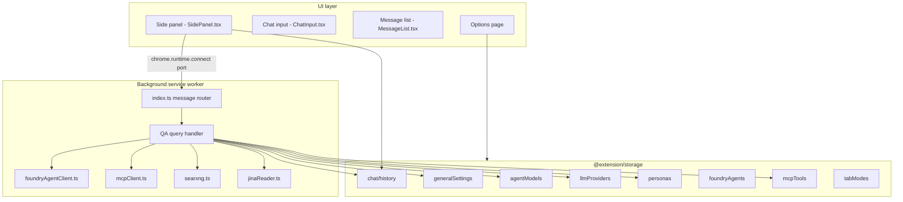
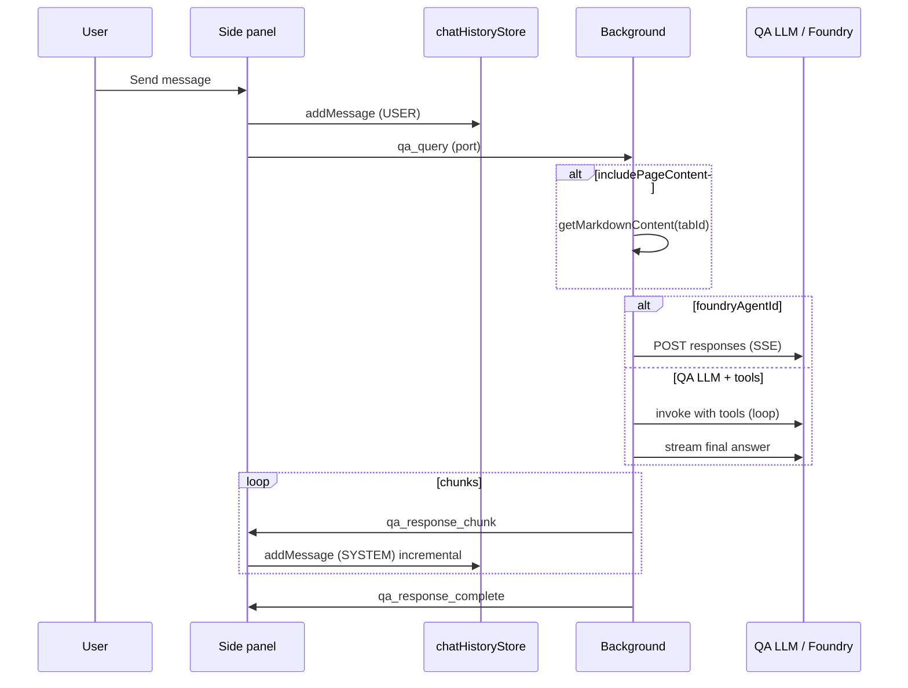

# Nanobrowser Architecture — QA Mode

This document describes how **QA Mode** works in Nanobrowser: a browser-local AI chat assistant that can ground answers in the current tab, call tools (web search, URL fetch, MCP), and stream responses in the side panel. It intentionally does **not** cover the multi-agent web automation stack (Planner, Navigator, Validator).

## Overview

Nanobrowser is a Chrome/Edge extension built as a **pnpm monorepo** with Turbo orchestration. QA Mode is one of two side-panel modes (`qa` vs `automation`). Users chat in the side panel; the **background service worker** runs LLM inference and tool execution; **Chrome extension storage** persists settings and chat history.



## Workspace layout (QA-relevant)

| Path | Role |
|------|------|
| `pages/side-panel/` | Chat UI, mode toggle, QA toolbar (model, persona, tools, page-content toggle) |
| `pages/options/` | Settings: General (SearXNG, QA budgets, appearance), Models (QA agent), Personas, Azure Foundry, MCP |
| `chrome-extension/src/background/` | Service worker: `qa_query` handler, tool loop, streaming |
| `packages/storage/` | Typed Chrome storage for settings and chat sessions |
| `packages/i18n/` | User-facing strings (`chat_*`, `options_*`, `bg_*`) |
| `packages/ui/`, `packages/shared/` | Shared React utilities and helpers |

Build output lands in `dist/`; each workspace bundles via Vite.

## QA Mode vs Automation Mode

| Aspect | QA Mode | Automation Mode (out of scope) |
|--------|---------|--------------------------------|
| Purpose | Answer questions, optional page context, tools | Multi-step browser automation |
| Background entry | `qa_query` | `new_task`, `follow_up_task`, executor |
| Model slot | `AgentNameEnum.QA` | Planner + Navigator |
| Default tab mode | `qa` (`tabModes.ts`) | User-selectable per tab |
| Session messages | `USER` + `SYSTEM` (assistant + tool traces) | Includes planner/navigator/validator actors |

Per-tab mode is stored under `tab_mode_{tabId}` and defaults to **`qa`** when unset.

## End-to-end request flow

1. **User sends a message** in the side panel (`SidePanel.tsx` → `handleSendMessage`).
2. **Session**: A chat session is created or continued (`chatHistoryStore`). The user message is persisted **before** the query is sent (including optional `imageDataList` for vision).
3. **Port message** `qa_query` is sent to the background with:
   - `query`, `sessionId`, `tabId`
   - `includePageContent`, `enableWebSearch`
   - `personaSystemPrompt`, `personaName`, or `foundryAgentId`
   - Optional `imageData` / `imageDataList`
4. **Background** (`index.ts`, case `qa_query`):
   - Aborts any in-flight QA stream for that tab.
   - Optionally loads **page markdown** via content-script DOM helpers when `includePageContent` is true.
   - Branches:
     - **Azure Foundry agent** → `streamFoundryAgentResponse` (no local tools).
     - **Configured QA LLM** → LangChain chat model + optional tool-calling loop, then streaming final answer.
5. **Streaming back** via port: `qa_response_chunk`, then `qa_response_complete` (or `qa_response_error`).
6. **Side panel** appends assistant text to the buffer, persists `SYSTEM` messages, and renders tool events inline.



## Background: QA query handler

The handler lives in `chrome-extension/src/background/index.ts` (approximately the `qa_query` case). Key behaviors:

### Page content grounding

When `includePageContent` is true, the worker injects DOM-tree scripts and calls `getMarkdownContent(tabId)` to obtain a markdown snapshot of the active page. That snapshot is injected into the **system prompt** (LLM path) or appended to the latest user turn (Foundry path).

When false, QA behaves as a **generic chat** without tab context.

### Answer path A — User-configured QA model

1. Load `agentModelStore.getAgentModel(AgentNameEnum.QA)` and resolve provider via `llmProviderStore`.
2. `createChatModel(provider, qaModel)` builds a LangChain `BaseChatModel`.
3. Register **dynamic tools** (see below) and `bindTools` when the model supports tool calling.
4. Build `conversationMessages`:
   - System: persona prompt, active persona name, optional page content, tool-usage hints.
   - History: prior `USER` / `SYSTEM` messages from the session (images as multimodal `HumanMessage`; tool traces replayed via `appendStoredQAToolEventToConversation`).
   - Current user query (skipped if already last in history).
5. **Tool loop** (if tools bound): up to `qaMaxToolRounds` rounds, respecting `qaMaxThinkingCalls` and `qaMaxNonThinkingToolCalls`. Tool results are emitted to the UI and persisted.
6. **Final answer**: either text from a non-tool model turn, or a follow-up `stream()` after a nudge to answer without more tools.
7. If no tool support: direct `stream(conversationMessages)`.

### Answer path B — Azure Foundry agent

When `foundryAgentId` is set (persona selection id `azf:{agentId}`):

- Loads agent from `foundryAgentsStore`.
- Builds input via `buildFoundryResponseInput` (user/assistant message pairs + optional page block).
- Calls `streamFoundryAgentResponse` in `foundryAgentClient.ts` against the project **OpenAI Responses** protocol URL.
- **Tools are disabled** on this path; the side panel disables the QA tools menu when a Foundry persona is active.

### Cancellation

Each tab connection may hold `qaStream: AbortController`. New queries abort the previous stream; disconnecting the side panel also aborts.

## Tool system

Tools are only used on the **QA LLM path** when the model implements `bindTools`.

| Tool | Name | Purpose | Gating |
|------|------|---------|--------|
| Thinking | `thinking` | Internal reasoning step (no external data) | `qaEnableThinkingTool` |
| Web search | `web_search` | SearXNG meta-search | Sidebar `enableWebSearch` + `qaEnableWebSearchTool` + `searxngBaseUrl` |
| URL fetch | `fetch_url` | Jina Reader readable extract | Same web-assist gating as search |
| MCP | `mcp:{server}/{tool}` or suffixed name | Remote MCP tool execution | Server endpoint configured; per-tool enablement in QA UI |

**Web assist** is controlled per message by the side-panel toggle (`enableWebSearch`) or falls back to `generalSettings.enableWebSearch`.

**Budgets** (from `generalSettings`):

- `qaMaxThinkingCalls` — cap on `thinking` invocations per answer.
- `qaMaxNonThinkingToolCalls` — shared cap for `web_search`, `fetch_url`, and MCP calls.
- `qaMaxToolRounds` — cap on model↔tool round-trips.

Tool activity is surfaced to the UI through **`qa_tool_event`** port messages (`emitQAToolEvent`), persisted on `ChatMessage.toolEvent` for replay in later turns.

MCP discovery and execution: `chrome-extension/src/background/services/mcpClient.ts`. Name collisions across servers get a short `_` + hex suffix via `allocateBoundMcpToolName`.

Enabled tool count for the toolbar badge: `qaToolCount.ts` (`computeQaEnabledToolCount` / cached variant).

## Messaging protocol (port)

Side panel connects with `chrome.runtime.connect({ name: 'side-panel' })`. QA-relevant message types:

| Type | Direction | Meaning |
|------|-----------|---------|
| `qa_query` | UI → BG | Start QA turn |
| `qa_response_chunk` | BG → UI | Streaming text delta |
| `qa_response_complete` | BG → UI | Turn finished |
| `qa_response_error` | BG → UI | Failure |
| `qa_tool_event` | BG → UI | Tool call/result for inline UI |
| `capture_screenshot` | UI → BG | Tab screenshot for vision QA |
| `screenshot_result` | BG → UI | Base64 image payload |

Tab id is threaded through messages so multi-tab side-panel usage does not cross streams.

## Storage model

### Chat history (`packages/storage/lib/chat/`)

- **Metadata**: `chat_sessions_meta` — list of sessions (id, title, timestamps, optional `tabId`).
- **Messages**: `chat_messages_{sessionId}` — array of `ChatMessage`.
- **Actors used in QA**: `USER`, `SYSTEM` (assistant text and `toolEvent` rows). Planner/Navigator/Validator entries in old sessions are skipped when rebuilding QA context.

`ToolEvent` carries `toolRunId`, `modelToolCallId`, `boundToolName`, and `toolArgs` so tool turns can be replayed into LangChain `AIMessage` / `ToolMessage` pairs.

### Settings (QA-relevant)

| Store | Key / file | Contents |
|-------|------------|----------|
| `generalSettingsStore` | `general-settings` | Page content default, SearXNG/Jina keys, QA tool toggles & budgets, QA appearance colors/fonts |
| `agentModelStore` | agent models | `AgentNameEnum.QA` → provider + model + parameters |
| `llmProviderStore` | providers | API keys, base URLs |
| `personasStore` | `personas-settings` | Named system prompts; `activePersonaId` |
| `foundryAgentsStore` | `foundry-agents-settings` | Azure Foundry agent endpoints and keys |
| `mcpToolsSettingsStore` | MCP servers | Transport, auth, per-server `enabledToolNames` |
| `tabModes` | per-tab keys | `automation` \| `qa` |

Personas and Foundry agents share the **persona dropdown**: Foundry entries use selection id `azf:{id}` and display prefix `AzF:`.

### QA appearance

`resolveQaUiTheme` (`qaAppearance.ts`) maps `generalSettings` QA color/font fields into CSS variables for the side panel when `mode === 'qa'`. Configured on the options **General** tab (`QaAppearanceSettings.tsx`).

## UI layer

### Side panel (`SidePanel.tsx`)

- Mode selector: **QA Mode** vs Automation Agent.
- QA state: model list, current QA model, personas (+ Foundry options), `includePageContent`, `enableWebSearch`, captured images, streaming buffers per tab.
- Subscribes to port for chunks/errors/tool events; merges into `messages` and storage.
- Applies `ResolvedQaUiTheme` to message list and chat chrome.

### Chat input (`ChatInput.tsx`)

QA-only toolbar:

- Model and persona `<select>` elements (auto-sized labels).
- Page content toggle (tab vs generic chat).
- Web search toggle (web assist).
- Tools menu: built-in toggles + per-MCP-tool switches (disabled for Foundry).
- Screenshot capture, file attach, microphone (speech) hooks.
- Tool count badge via `qaEnabledToolCount`.

### Options page (`Options.tsx`)

Tabs: General, Models, Personas, Azure Foundry, MCP, About. QA configuration is spread across General (SearXNG, budgets, appearance), Models (QA agent), Personas, Foundry, and MCP.

## External integrations

| Service | Module | Used for |
|---------|--------|----------|
| SearXNG | `services/searxng.ts` | `web_search` tool |
| Jina Reader | `services/jinaReader.ts` | `fetch_url` tool |
| MCP servers | `services/mcpClient.ts` | Dynamic tools |
| Azure Foundry | `services/foundryAgentClient.ts` | Hosted agents via Responses API |
| LLM providers | LangChain chat models via `createChatModel` | Primary QA inference |

All network calls originate from the **background worker** (extension permissions), not from the side-panel page.

## Security and privacy notes

- API keys and Foundry tokens live in **extension local storage** on the user’s machine.
- Page content is read only when the user enables **Include page content** (or sends with that toggle on).
- MCP and SearXNG calls go to user-configured endpoints; the extension does not ship a default search backend.
- Tool argument JSON for MCP is parsed locally; failures are returned to the model as tool results, not thrown to the UI.

## Extension points

Likely touch points for QA features:

- New tools: register `DynamicStructuredTool` in the `qa_query` handler and extend `computeQaEnabledToolCount` / options UI.
- New persona sources: extend `personasStore` / side-panel persona list merging.
- UI: `ChatInput.tsx`, `MessageList.tsx`, `SidePanel.tsx`.
- Persistence: `packages/storage/lib/chat/types.ts` for new message fields.

## Related files (quick reference)

```
pages/side-panel/src/SidePanel.tsx          # QA UX orchestration
pages/side-panel/src/components/ChatInput.tsx
chrome-extension/src/background/index.ts    # qa_query handler
chrome-extension/src/background/services/foundryAgentClient.ts
chrome-extension/src/background/services/mcpClient.ts
chrome-extension/src/background/services/searxng.ts
chrome-extension/src/background/services/jinaReader.ts
chrome-extension/src/background/qaToolCount.ts
packages/storage/lib/chat/
packages/storage/lib/settings/generalSettings.ts
packages/storage/lib/settings/personas.ts
packages/storage/lib/settings/foundryAgents.ts
packages/storage/lib/settings/mcpTools.ts
pages/options/src/components/GeneralSettings.tsx
pages/options/src/components/FoundryAgentsSettings.tsx
pages/options/src/components/McpToolsSettings.tsx
pages/options/src/components/PersonasSettings.tsx
```
